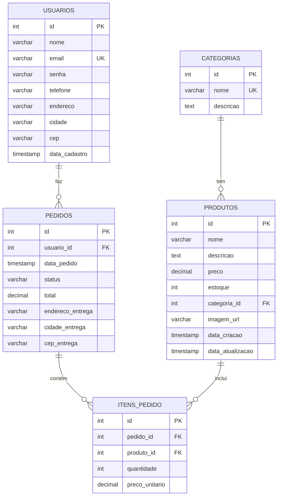

# Esquema do Banco de Dados - E-commerce Project

Este documento detalha a estrutura do banco de dados MySQL para o E-commerce Project, incluindo tabelas, colunas, tipos de dados e relacionamentos.

## 📊 Visão Geral

O banco de dados será composto pelas seguintes tabelas principais:

- `categorias`: Armazena as categorias dos produtos.
- `produtos`: Contém as informações detalhadas de cada produto.
- `usuarios`: Gerencia os dados dos usuários (clientes).
- `pedidos`: Registra os pedidos realizados pelos clientes.
- `itens_pedido`: Detalha os produtos incluídos em cada pedido.

## 📝 Detalhes das Tabelas

### Tabela: `categorias`

Armazena as diferentes categorias de produtos, permitindo uma organização hierárquica ou simples.

| Coluna      | Tipo de Dados     | Restrições      | Descrição                               |
|-------------|-------------------|-----------------|-----------------------------------------|
| `id`        | INT(11)           | PRIMARY KEY, AI | Identificador único da categoria        |
| `nome`      | VARCHAR(255)      | NOT NULL, UNIQUE| Nome da categoria (ex: Eletrônicos)     |
| `descricao` | TEXT              | NULL            | Descrição opcional da categoria         |

### Tabela: `produtos`

Contém todas as informações sobre os produtos disponíveis na loja.

| Coluna        | Tipo de Dados     | Restrições             | Descrição                                   |
|---------------|-------------------|------------------------|---------------------------------------------|
| `id`          | INT(11)           | PRIMARY KEY, AI        | Identificador único do produto              |
| `nome`        | VARCHAR(255)      | NOT NULL               | Nome do produto                             |
| `descricao`   | TEXT              | NULL                   | Descrição detalhada do produto              |
| `preco`       | DECIMAL(10, 2)    | NOT NULL               | Preço do produto                            |
| `estoque`     | INT(11)           | NOT NULL, DEFAULT 0    | Quantidade em estoque                       |
| `categoria_id`| INT(11)           | FOREIGN KEY            | ID da categoria do produto                  |
| `imagem_url`  | VARCHAR(255)      | NULL                   | URL da imagem do produto (opcional)         |
| `data_criacao`| TIMESTAMP         | DEFAULT CURRENT_TIMESTAMP | Data e hora de criação do registro          |
| `data_atualizacao`| TIMESTAMP     | DEFAULT CURRENT_TIMESTAMP ON UPDATE CURRENT_TIMESTAMP | Última atualização do registro |

### Tabela: `usuarios`

Armazena os dados dos clientes que se cadastram na loja.

| Coluna        | Tipo de Dados     | Restrições             | Descrição                                   |
|---------------|-------------------|------------------------|---------------------------------------------|
| `id`          | INT(11)           | PRIMARY KEY, AI        | Identificador único do usuário              |
| `nome`        | VARCHAR(255)      | NOT NULL               | Nome completo do usuário                    |
| `email`       | VARCHAR(255)      | NOT NULL, UNIQUE       | Endereço de e-mail do usuário               |
| `senha`       | VARCHAR(255)      | NOT NULL               | Hash da senha do usuário                    |
| `telefone`    | VARCHAR(20)       | NULL                   | Telefone de contato                         |
| `endereco`    | VARCHAR(255)      | NULL                   | Endereço de entrega                         |
| `cidade`      | VARCHAR(100)      | NULL                   | Cidade                                      |
| `cep`         | VARCHAR(10)       | NULL                   | Código de Endereçamento Postal              |
| `data_cadastro`| TIMESTAMP        | DEFAULT CURRENT_TIMESTAMP | Data e hora de cadastro do usuário          |

### Tabela: `pedidos`

Registra cada pedido realizado pelos clientes.

| Coluna        | Tipo de Dados     | Restrições             | Descrição                                   |
|---------------|-------------------|------------------------|---------------------------------------------|
| `id`          | INT(11)           | PRIMARY KEY, AI        | Identificador único do pedido               |
| `usuario_id`  | INT(11)           | FOREIGN KEY            | ID do usuário que fez o pedido              |
| `data_pedido` | TIMESTAMP         | DEFAULT CURRENT_TIMESTAMP | Data e hora do pedido                       |
| `status`      | VARCHAR(50)       | NOT NULL               | Status do pedido (ex: Pendente, Concluído)  |
| `total`       | DECIMAL(10, 2)    | NOT NULL               | Valor total do pedido                       |
| `endereco_entrega`| VARCHAR(255)  | NOT NULL               | Endereço de entrega do pedido               |
| `cidade_entrega`| VARCHAR(100)    | NOT NULL               | Cidade de entrega                           |
| `cep_entrega` | VARCHAR(10)       | NOT NULL               | CEP de entrega                              |

### Tabela: `itens_pedido`

Detalha os produtos incluídos em cada pedido, relacionando-os à tabela `pedidos` e `produtos`.

| Coluna        | Tipo de Dados     | Restrições             | Descrição                                   |
|---------------|-------------------|------------------------|---------------------------------------------|
| `id`          | INT(11)           | PRIMARY KEY, AI        | Identificador único do item do pedido       |
| `pedido_id`   | INT(11)           | FOREIGN KEY            | ID do pedido ao qual o item pertence        |
| `produto_id`  | INT(11)           | FOREIGN KEY            | ID do produto incluído no pedido            |
| `quantidade`  | INT(11)           | NOT NULL               | Quantidade do produto no pedido             |
| `preco_unitario`| DECIMAL(10, 2)  | NOT NULL               | Preço do produto no momento da compra       |

## 🔗 Relacionamentos

- `produtos.categoria_id` REFERENCIA `categorias.id` (Um produto pertence a uma categoria)
- `pedidos.usuario_id` REFERENCIA `usuarios.id` (Um pedido é feito por um usuário)
- `itens_pedido.pedido_id` REFERENCIA `pedidos.id` (Um item de pedido pertence a um pedido)
- `itens_pedido.produto_id` REFERENCIA `produtos.id` (Um item de pedido se refere a um produto)

## 📈 Diagrama ER (Entidade-Relacionamento)

---

**Última atualização**: Agosto 2025

